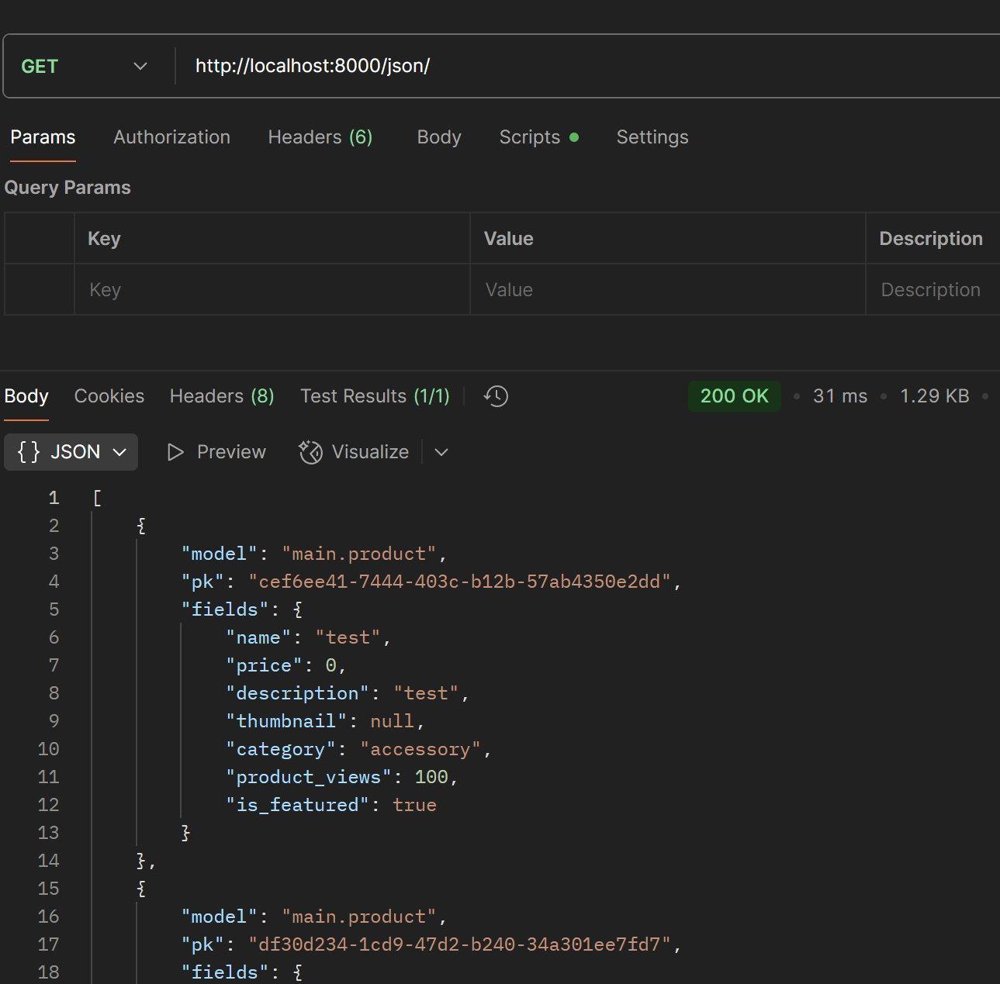
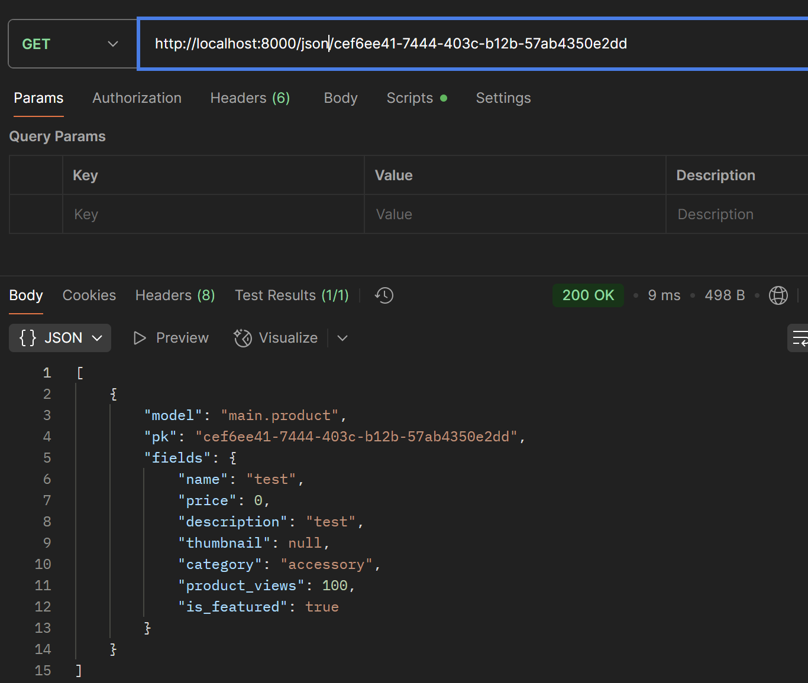
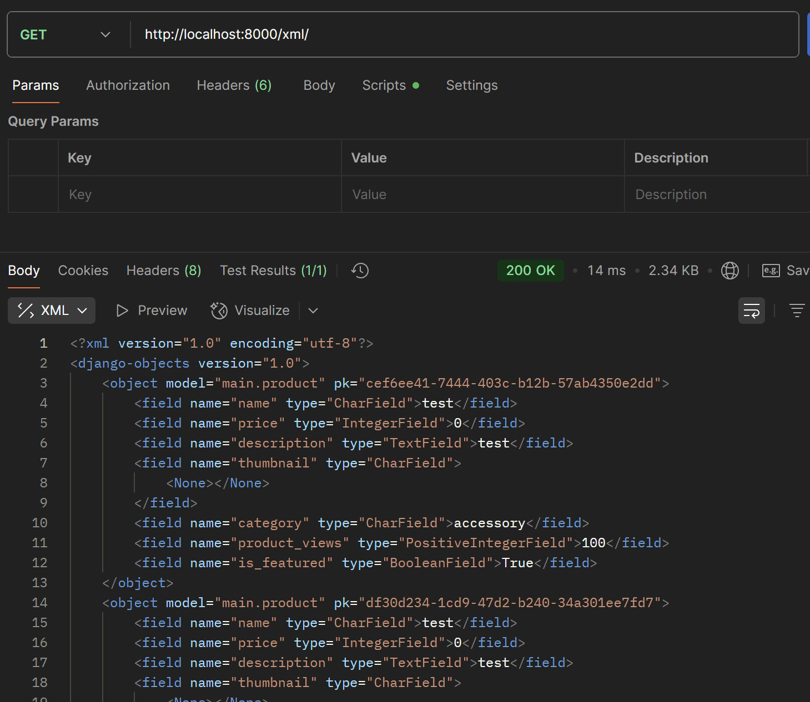
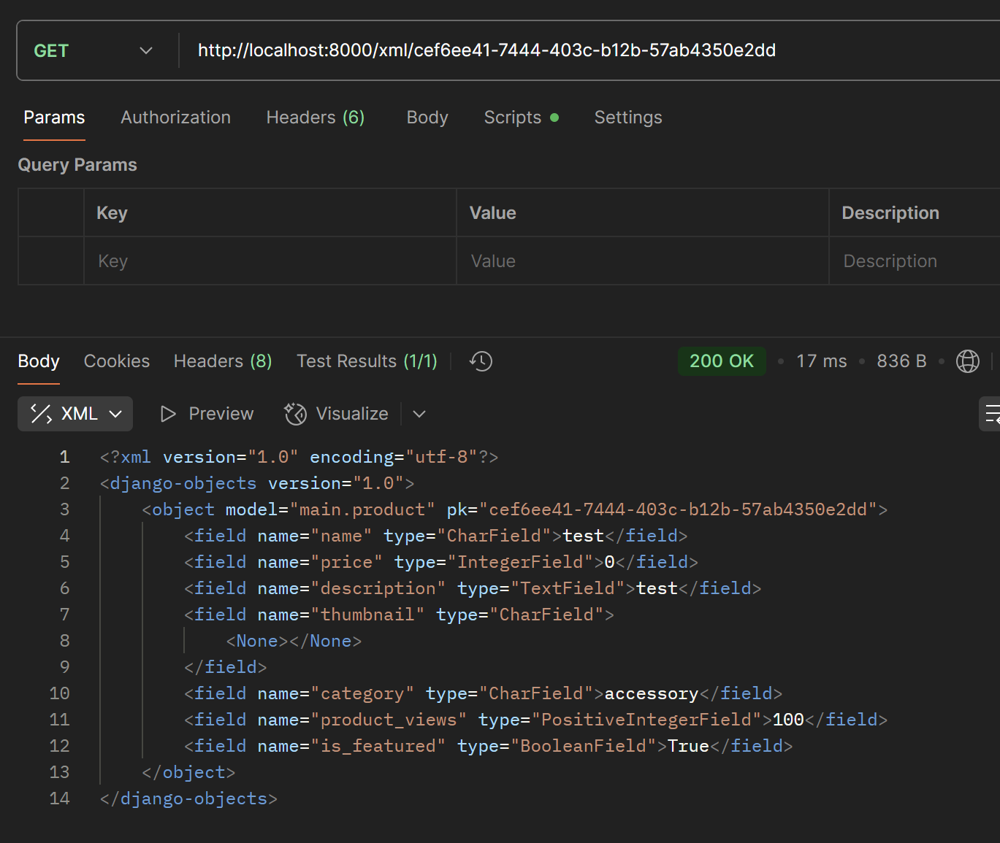

- Data delivery digunakan dalam platform karena platform sekarang ini biasanya berinteraksi dengan banyak user, sistem, dan perangkat secara real-time atau near-real-time

---

- JSON, karena JSON mudah dibaca dan juga lebih ringkas dan ringan.

---

- Fungsi is_valid() diperlukan untuk memeriksa dan memverifikasi data yang diberikan, apakah sudah memenuhi syarat sesuai dengan setting-setting pada field yang diberikan.

---

- Karena csrf_token dibutuhkan untuk melindungi form dari request palsu yang datang dari situs luar. Tanpa csrf_token, platform rentan diserang oleh CSRF dari website lain, yang bisa menyebabkan aksi tidak sah atas nama user. Django secara default menolak POST tanpa token, sehingga ini merupakan lapisan keamanan yang penting.

---

- Cara implementasi checklist step-by-step, saya tidak hanya mengikuti tutorial. Namun saya juga berusaha untuk memahami apa yang terjadi dan bagaimana cara kerjanya dari internet ataupun AI tools.

---

- Tidak ada

--- 

## POSTMAN

